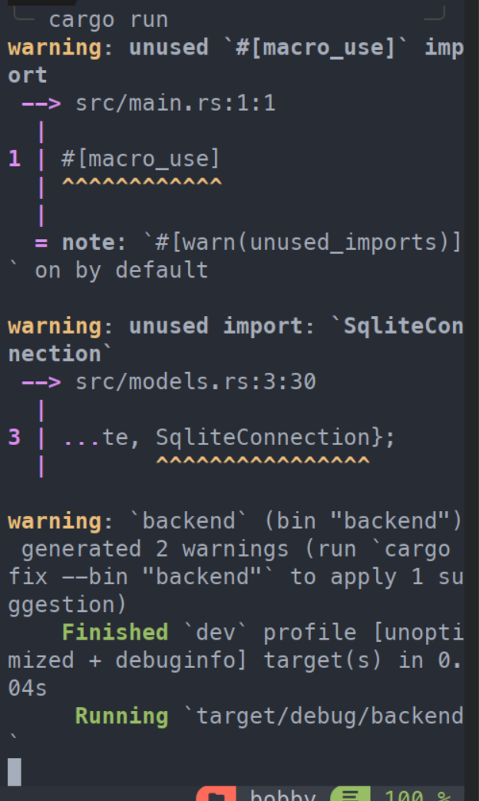
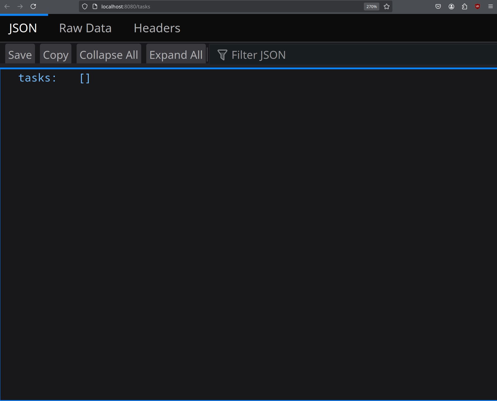
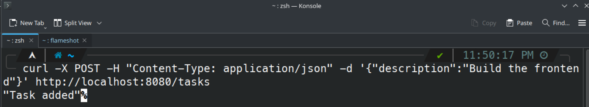
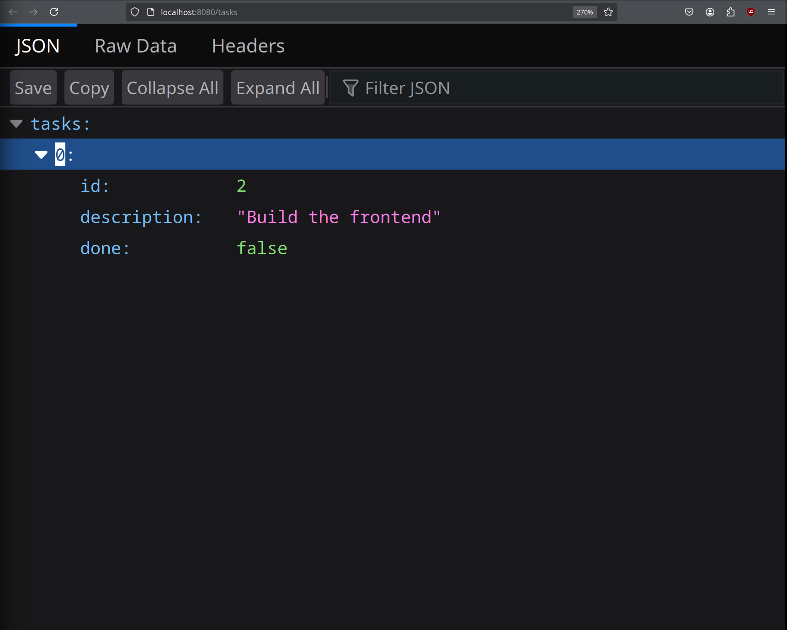
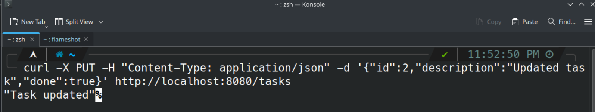
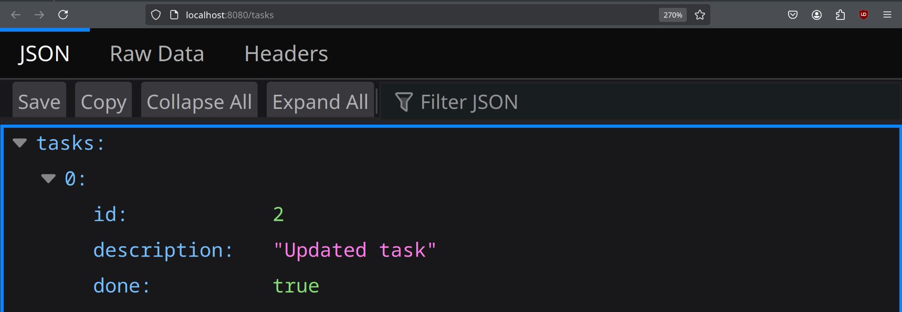
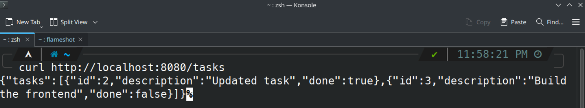
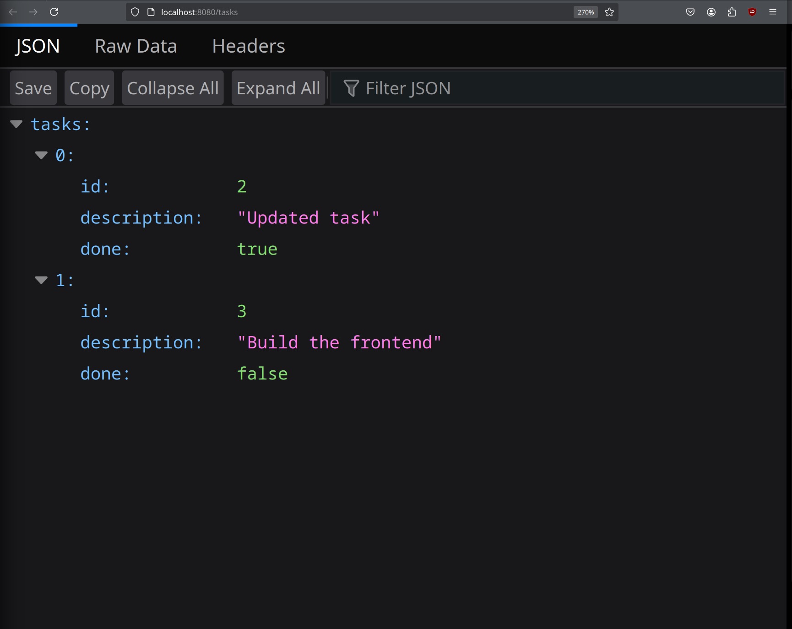
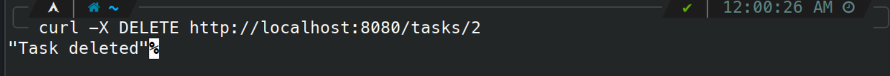
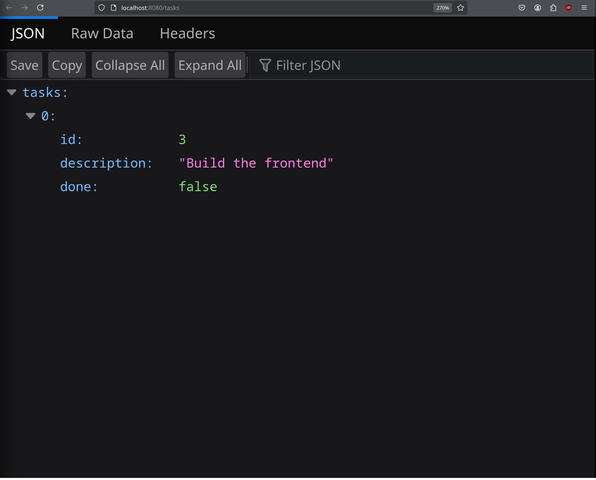

# FullStackRustToDoList

## How to install the backend

1. Install Rust Toolchain
```sh
curl --proto '=https' --tlsv1.2 -sSf https://sh.rustup.rs | sh
```

2. Install Database
```sh
sudo <whatever your installer is> -S sqlite
```

3. Install Diesel CLI
```sh
cargo install diesel_cli --no-default-features --features sqlite
```

4. Clone the Repository
```sh
git clone https://github.com/username/TODO_Rust_FullStack.git
```

5. Navigate to the backend directory:
```
cd TODO_Rust_FullStack/backend
```

6. Build the backend server
```sh
cargo build
```

7. Run the backend
```
cargo run
```

## what arjun needs to do

* Build a basic website with with a search bar in the center that you can type and it will search the site for results and bring a drop down with results

## What I need to work on

* Build a front end website 

## What I have done so far

1. Backend server to connect to


2. Blank database that you can connect to with localhost


3. POST to server that saves to database


4. database with task


5. PUT to server that updates the database


6. Updated database with new task and if completed


7. GET to server that returns all stuff in the database


8. you can compair the GET return and the local host database


9. DELETE to server that deletes task with id 2


10. Removed task from database

